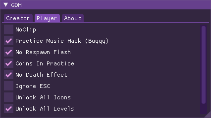

# GDH

Mod Menu for Geometry Dash 2.2

# How to install?

1. Go to [Releases](https://github.com/TobyAdd/GDH/releases/latest)
2. Download Release.zip
3. Extract the archive to your Geometry Dash folder
4. Open Geometry Dash and press tab to toggle the UI

# Compiling

Install CMake

### Run these commands

1. `cmake -B build -DCMAKE_BUILD_TYPE=Release -T host=x86 -A win32`
2. `cmake --build build --config Release --target ALL_BUILD`

**_Move GDH.dll (build/Releases), libExtensions.dll and hacks.json into your GD folder._**

# Special Thanks

Ocornut for [ImGui](https://github.com/ocornut/imgui)
